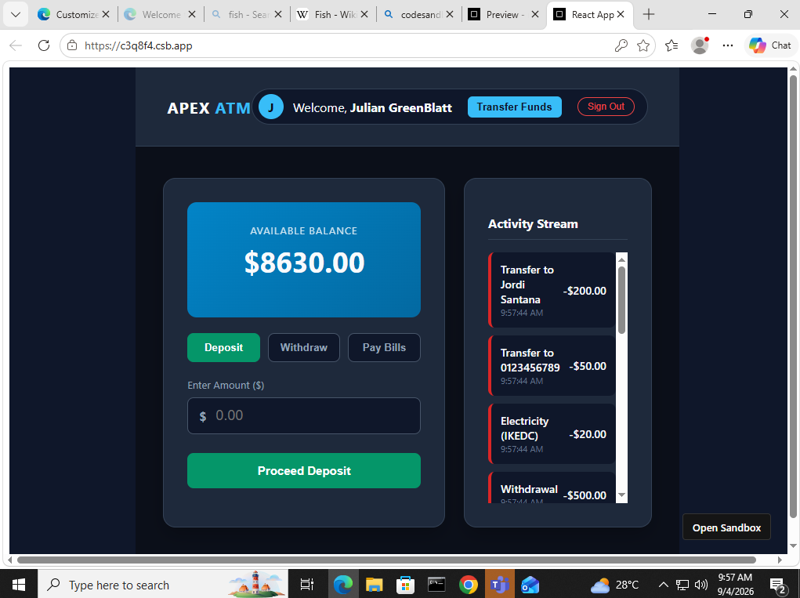
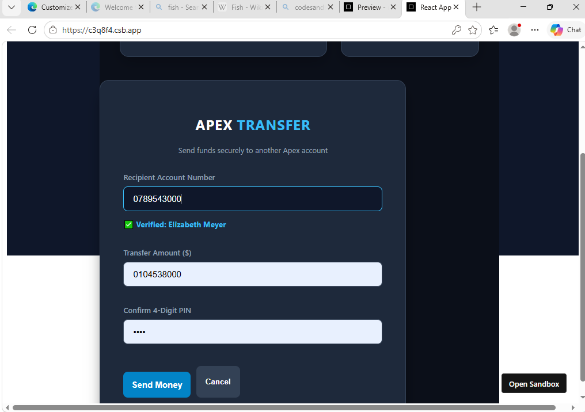
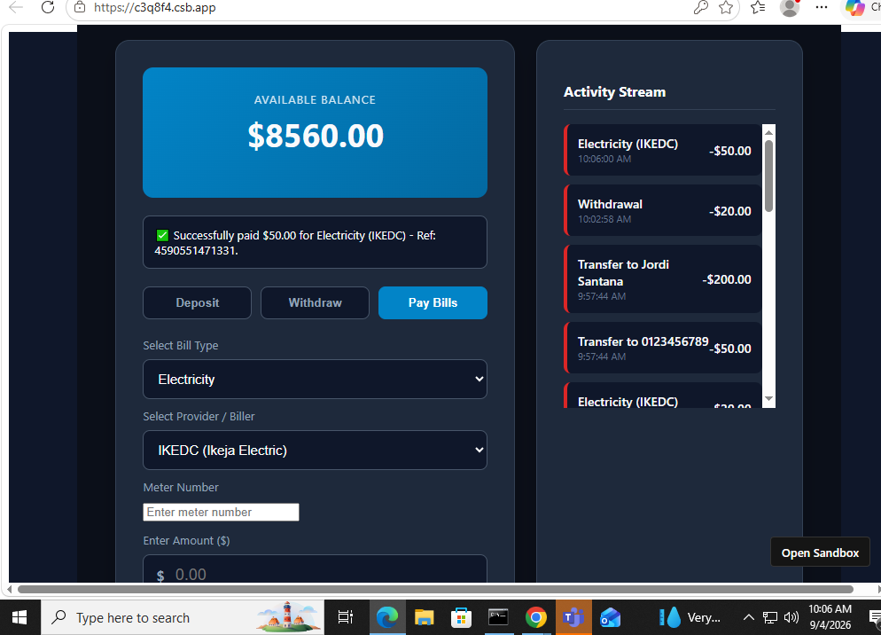

# Apex Bank ATM — Cloud-Based Virtual Banking & CRUD Application 💳

A full-stack, cloud-powered virtual ATM and fintech application built using **React.js** for the frontend and **Supabase (PostgreSQL)** for the backend database infrastructure. 

## ✨ Features & Architecture

* **Secure Authentication & PIN Protection:** Handles user login sessions and requires 4-digit transaction PIN authorizations for financial operations.
* **Real-Time Account Verification:** Dynamically queries the database to validate recipient account numbers and display account names before executing transfers.
* **Core Banking CRUD Operations:** Enables complete creation, reading, updating, and deleting of banking states, supporting cash deposits, quick-shortcut withdrawals, and live balance recalculations.
* **Integrated Bill Payments:** Allows users to select utility types and providers (such as IKEDC for electricity) with automated reference tracking.
* **Live Activity Stream:** Real-time transaction logging that instantly captures every deposit, withdrawal, fund transfer, and bill payment.

## 🛠️ Tech Stack

* **Frontend:** React.js, CSS
* **Backend & Database:** Supabase, PostgreSQL

## 📸 Application Screenshots

### User Dashboard & Live Activity Stream
.

### Account Verification & Secure Transfer Modal


### Bill Payment & Utility Module


## 🚀 How to Run Locally

1. Clone the repository:
   ```bash
   git clone [https://github.com/Gwest94/Apex-Bank-ATM.git](https://github.com/Gwest94/Apex-Bank-ATM.git)
